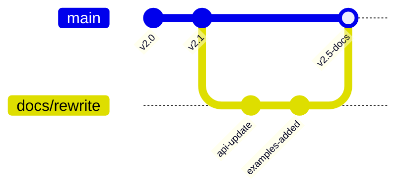

```markdown
---
marp: true
theme: my-custom-theme
title: "Product Documentation: Nebula Analytics Platform"
description: "Technical Documentation for v2.5"
author: "Technical Writer - 23f2004089@ds.study.iitm.ac.in"
paginate: true
header: "Nebula Analytics • Confidential"
footer: "© 2024 Nebula Software • Page ${{page}} of ${{total}}"
---

<!-- Theme Definition -->
<style>
:root {
  --primary: #2563eb;
  --secondary: #7c3aed;
  --dark: #1e293b;
  --light: #f8fafc;
}

/* Custom Theme */
section {
  font-family: 'Segoe UI', system-ui, sans-serif;
  background: linear-gradient(135deg, var(--light) 0%, #e0f2fe 100%);
  color: var(--dark);
  padding: 50px;
}

h1 {
  color: var(--primary);
  border-bottom: 3px solid var(--secondary);
  padding-bottom: 15px;
}

h2 {
  color: var(--secondary);
}

code {
  background: #1e293b;
  color: #7dd3fc;
  padding: 2px 6px;
  border-radius: 4px;
}

.highlight-box {
  background: linear-gradient(90deg, #dbeafe 0%, #ede9fe 100%);
  border-left: 4px solid var(--primary);
  padding: 20px;
  border-radius: 0 8px 8px 0;
  margin: 20px 0;
}
</style>

<!-- Slide 1: Title Slide -->
# Nebula Analytics Platform
### Technical Documentation v2.5

**Documentation Team Contact:**  
23f2004089@ds.study.iitm.ac.in

**Maintained in:** GitHub Repository `/docs/product`  
**Last Updated:** October 2024

---

<!-- Slide 2: Architecture Overview -->


# System Architecture

## Core Components

1. **Data Ingestion Layer**
   - Real-time stream processing
   - Batch data pipelines

2. **Analytics Engine**
   - Query optimization
   - Distributed computation

3. **Storage Layer**
   - Columnar database
   - Metadata repository

```yaml
architecture:
  scalability: "horizontal"
  deployment: "kubernetes"
  data_format: "parquet"
```

---

<!-- Slide 3: Performance Metrics -->

# Performance Characteristics

## Algorithmic Complexity Analysis

### Query Execution Time
$$
T(n) = O(\log n) + k \cdot O\left(\frac{n}{p}\right)
$$

Where:
- $n$ = dataset size
- $p$ = parallel nodes
- $k$ = query complexity factor

### Space Complexity
$$
S(n) = O(n \log n) \text{ for indexing}
$$

---

<!-- Slide 4: Installation Guide -->

<!-- _class: highlight-box -->

# Installation & Configuration

## Quick Start

```bash
# Clone the repository
git clone https://github.com/nebula/analytics-platform.git

# Install dependencies
npm install @nebula/core @nebula/ui

# Environment configuration
export NEBULA_API_KEY="your_key_here"
export DB_CONNECTION_STRING="postgresql://..."
```

## Requirements
- Node.js 18+
- PostgreSQL 14+
- 8GB RAM minimum
- Docker (optional)

---

<!-- Slide 5: API Reference -->

# API Reference v2

## Core Endpoints

| Endpoint | Method | Description | Complexity |
|----------|--------|-------------|------------|
| `/api/v2/query` | POST | Execute analytics query | $O(\log n)$ |
| `/api/v2/datasets` | GET | List available datasets | $O(1)$ |
| `/api/v2/health` | GET | System health check | $O(1)$ |

## Example Request

```json
{
  "query": "SELECT cohort, AVG(revenue) FROM users",
  "filters": {"date_range": "2024-01/2024-10"},
  "format": "json"
}
```

---

<!-- Slide 6: Background Image Slide -->


<!-- _class: invert -->
<style scoped>
h1, p {
  color: white;
  text-shadow: 2px 2px 4px rgba(0,0,0,0.7);
}
</style>

# Data Visualization Suite

## Real-time Dashboard Features

- **Live data streaming** with WebSocket support
- **Custom chart builder** with drag-and-drop
- **Export capabilities** (PNG, PDF, CSV)
- **Collaborative annotations**

> Contact for customization: 23f2004089@ds.study.iitm.ac.in

---

<!-- Slide 7: Maintenance & Version Control -->

# Documentation Maintenance

## Version Control Strategy



## Output Formats Supported
- **PDF** (via Marp CLI)
- **HTML** (web deployment)
- **PPTX** (Microsoft PowerPoint)
- **Images** (per slide export)

---

<!-- Slide 8: Troubleshooting -->

# Common Issues & Solutions

## Performance Optimization

<div class="highlight-box">

### Slow Query Execution
```sql
-- Before: O(n²) complexity
SELECT * FROM users u1, users u2 WHERE u1.id = u2.ref_id;

-- After: O(n log n) with indexing
CREATE INDEX idx_ref_id ON users(ref_id);
SELECT * FROM users u1 JOIN users u2 ON u1.id = u2.ref_id;
```

</div>

## Getting Help
- Documentation: `docs.nebula.tech`
- Email Support: `23f2004089@ds.study.iitm.ac.in`
- GitHub Issues: `/nebula/analytics-platform/issues`

---

<!-- Slide 9: Conclusion -->

# Summary & Resources

## Key Features
- ✅ Real-time analytics processing
- ✅ Scalable distributed architecture
- ✅ Comprehensive API (REST & GraphQL)
- ✅ Multi-format export capabilities

## Documentation Links
- [API Reference](https://api.nebula.tech/v2)
- [GitHub Repository](https://github.com/nebula/analytics-platform)
- [Interactive Examples](https://playground.nebula.tech)

## Contact
**Documentation Maintainer:**  
23f2004089@ds.study.iitm.ac.in  
**Updates:** Weekly documentation releases

